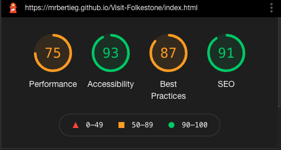

# Visit *Folkestone* Website

## Introduction

Welcome to [Visit *Folkestone*](https://mrbertieg.github.io/Visit-Folkestone/index.html) website.

This website is designed to help users visiting the town of Folkestone to find popular landmarks, find a place to eat, explore and book a stay. Folkestone is located in the South East of Kent, UK. It is home to the famous Eurotunel connecting the UK and France via an underground tunnel under the English Channel.

  

# Table of Contents

## [1.User Experience](#user-ex) 
- User Expectations
- Design Approach
## [2. Features](#features)
- Navigation
- Header
- External Links
- Video
- Footer
- Town Tour Page
- Contact Page
## [3. Wireframe](#wireframe)
## [4. Deployment](#deployment)
## [5. Manual Testing](#manual-testing)
## [6. Technologies Used](#tech-used)
## [7. Bugs](#bugs)
## [8. Credits](#credits)

  

# 1. <a name="user-ex">User Experience</a>
## A user visiting the website would expect the following:
- To find it easy to understand the purpose of the website.
- To easily navigate the website through it's contents.
- To find information on the things to do in the town of Folkestone
- To find information on the places to eat.
- To find information on the places to stay.
- To find information on the places to park.
- To find information on how to find the town.

  

## Design Approach
- The reason why I chose this design for the website is because it's simplicity. Users spend a matter of seconds on a website before they decide if this is the place for them or not. 

- Visit Folkestone presents its information quickly and it allowes the users to find the location of where each picture was taken by clicking on each picture, whilst redirecting them to an exact location on Google Maps.

- The pictures on the website were taken by me, and I have kept the picture cropping to a minimum. The reason behind this is to allow the user to experience the highest quality so that they can immerse themselvs in the experience. I believe that this is an important decisive factor if a user wants to visit the town of Folkestone.

- The primary purpose of the website is to attract visitors. 

# <a name="features">2. Features</a>

## Navigation 

- The Navigation bar features a Lighthouse as the Logo of the Page, the main title "Visit Folkestone" and the 3 navigation tabs. 
- The navigation tabs are: HOME | TOWN TOUR | CONTACT and each tab will take you to different pages on the website.
- The Navigation bar has an .active and .hover feature. 
- The background colour sample of the navigation tabs was sampled using a Chrome web browser extension called Eye Dropper. The colour was picked from the sky in the main banner picture in the landing page to establish a colour scheme. 
- The picture logo was custom made by using an online tool called [Brand Crowd](https://www.brandcrowd.com/).

  

## Header 

- The header contains the main banner of the page. The imaged in the banner zooms out as the user first loads up the page. 
- The header contains a section where it explains to the user what is the main purpose of the website.
- The colour scheme is continued in the header's description. 

  

## External Links Section 
- The External Links section is made of four links which redirect the user to different websites depending on their interest. Clicking on any of the links will open a new tab to an external website. The background colour for each title tag was set in a way that it contrast with the white writing for the best user experience.
These four links are:
    - Landmarks: This will take the user to an external webpage on [Tripadvisor](https://www.tripadvisor.co.uk/Attractions-g190749-Activities-c47-Folkestone_Kent_England.html)
    - Eat Local: This will take the user to an external webpage on [Folkelife.](https://folke.life/folkestone/food-and-drink/)
    - Book a Stay: This will take the user to an external webpage on [Trivago](https://www.trivago.co.uk/folkestone-39398/hotel)
    - Find Parking: This will take the user to an external webpage [Folkestone & Hythe District Council/Parking](https://www.folkestone-hythe.gov.uk/parking/car-parks)

  

## Visit Folkestone Video 
- The video is situated at the bottom of the page. It's a video of Folkestone and it has been taken from the [Folkestone & Hythe Distric Council Youtube channel](https://www.youtube.com/embed/6g7u5iQxjm8). The video will play within the page but it not play automatically or looped. The video has controls such as play and pause, mute and unmute. 

  

## Footer  

- The footer contains four logos, and each logo has it's own external clickable link.
- The colour of the icons is the same as the navigation tabs.
- The logos were imported from [Fontawesome](https://fontawesome.com/).

  

## Town Tour

- This page is split in to three sections.
- Each section contains photos of different parts of the town. All of the pictures have been taken by me. 
- The pictures are clickable with a new tab openining and directing the user to a google map location on where that set picture was take. This wat the user can find and experience each location.  
    - To the Beach!   
    - To the Harbour!   
    - To the High Street!     
    
  

  

## Contact

- This page contains a main picture banner, a feedback form where visitors can leave a comment on their experience on visiting the town of Folkestone, contact details for the website's Admin Team and an interractive Google Maps for those who need to find out where Folkestone is located in the UK. 
- Once filled, the form will present with the following action: 

  

## <a name="wireframe">3. Website Wireframe</a>

- The website's skeleton was designed using [Balsamiq]()
- Three versions were designed: Mobile, Tablet and Web Browser.
- Although the Website is not 100% identical to the wireframe, this has proven to be a useful tool in establishing how the website will be designed. 

Mobile 

Tablet

Web Browser

  

## <a name="manual-testing">4. Manual Testing</a>

TEST | ACTION | RESULT |
-----|:--------:|--------|
Landing Page | Clicking on the Logo, Title, and Main Picture banner will redirect to the main landing page. Clicking on the video will play with no issues. All other links in the landing page will redirect the user to extewrnal pages. All links work correctly| PASS
Town Tour Page | Clicking "Town Tour" tab in the nav bar will redirect you to the second page of the website. All images have been tested, and will redirect the user successfully to external pages | PASS
Contact Page | Clicking "Contact" tab in the nav bar will redirect you to the third page of the website. The submission form will send the information successfully to https://formdump.codeinstitute.net/ . The google maps interractive map also works successfully | PASS
Text | All fonts and colours have been consistent throughout the website | PASS
Footer | The footer contains four social media icons. Facebook, Instagram, Youtube, Twitter which when clicked, will redirect the user to their respective website. | PASS

- Chrome Developer Tools Lighthouse. The Performance is in the amber zone due the the picture sizes. Visit Folkestone is a website designed to attract visitors so the aim is for the pictures to be as clear and high definition as possible to entice people to come over. The Website still performes well.

- W3C Validator.

- Jigsaw Validator.

  

## <a name="tech-used">5. Technologies Used</a>

- [HTML5](https://en.wikipedia.org/wiki/HTML5) HyperText Markup Language.
- [CSS3](https://en.wikipedia.org/wiki/CSS) Cascade Style Sheets.
- [GitHub](https://github.com/) is used to store the project by commiting changes and pushing them via a terminal.
- [GitPod](https://www.gitpod.io/) is used to code the website.
- [Balsamiq](https://balsamiq.com/) is used for the mockup of the website before coding. 
- [Mac Os Preview](https://support.apple.com/en-gb/guide/preview/welcome/mac) is a tool on MacBook used to view and make changes to image files. I used this to resize images in order to fit the website. 
- [Font Awesome](https://fontawesome.com/) is used for the footer icons. 
- [Google Fonts](https://fonts.google.com/) is used to implement the two fonts used in the website. Fira Sans and Oxygen. 
- [Google Chrome](https://www.google.co.uk/chrome/?brand=FHFK&gclid=CjwKCAjw4KyJBhAbEiwAaAQbE7E7ZbTy2V4OGQXkCgmeXbu-JV5E2tI_lsBDZJbPAwgteMPU3DRvnxoCj_wQAvD_BwE&gclsrc=aw.ds) Is used to preview the website throught the development cycle. 
- [Google DevTools](https://developers.google.com/web/tools) is used for tersting and also making changes in real time thriught the development process.
- [Eye Dropper](https://chrome.google.com/webstore/detail/eye-dropper/hmdcmlfkchdmnmnmheododdhjedfccka?hl=en) is a Chrome extension used to select colours and find out the rgba or hex combination of set colours. I used this to pick a colour from the sky of the main banner picture in the landing page in order to set the colour theme of the website. 
- [Unicorn Revealer](https://chrome.google.com/webstore/detail/unicorn-revealer/lmlkphhdlngaicolpmaakfmhplagoaln?hl=en-GB) is a Chrome extension used to preview margins of the Box Model CSS uses. It was particularly helpful to trouble shoot indentation issues and media query formating. 
- [Viewport Resizer](https://chrome.google.com/webstore/detail/viewport-resizer-%E2%80%93-respon/kapnjjcfcncngkadhpmijlkblpibdcgm?hl=en) is a Chrome extension used to simulate the viewport of various devices, from Mobile to Desktop. 
- [Readme](https://chrome.google.com/webstore/detail/readme-text-to-speech-rea/npdkkcjlmhcnnaoobfdjndibfkkhhdfn?hl=en-GB) is a Text-to-speach reader. This was particularly useful to use as it shows first hand what might visually impaired users would hear if the pictures can't be seen. 
- [W3C Markup](https://validator.w3.org/) and [Jigsaw](https://jigsaw.w3.org/css-validator/) validators are used to check the syntax of both languages.

  

## <a name="deployment">6.Deployment</a>

To deploy my website I have used GitHub. In order to do so I have followed the below steps:

- Create a repository on GitHub.
- Go to the list of repository in GitHub.
- Select  the repository you wish to deploy, in my case Visit-Folkestone repository.
- In the top navigation bar select Settings.
- On the left column list select Pages.
- Under Source click on the drop down arrow next to None and select Main and press Save. The page will refresh.
- The web address will appear. Example: https://mrbertieg.github.io/Visit-Folkestone/
- Refresh the page again and a green tick will appear next to the new web address. 

  

## <a name="bugs">7.Bugs</a>

- There were some initial bugs in the website which were solved later one with the help of my fellow colleagues in [Slack](https://slack.com/intl/en-gb/). Bugs included things such as: 
    - Small section above the header was clickable but only showing in large screen sizes. 
    - iFrame didn't work as did not used embeded code. 

      

## <a name="credits"> 8. Credits</a>

- The zoom effect was inspired from the Love Running Project.
- The Logo picture, Page title and all pictures but [one](assets/images/town_tour_images/ship_leaving.jpeg) were created and taken by me.
- [W3Scools](https://www.w3schools.com/) was used for generic code inspiration. 
- To my Mentor, Marcel Mulders for his feedback.
- README.md was inspired by https://github.com/dhakal79/Portfolio-project-MS1#deployment and https://github.com/iKelvvv/MS1#known-bugs