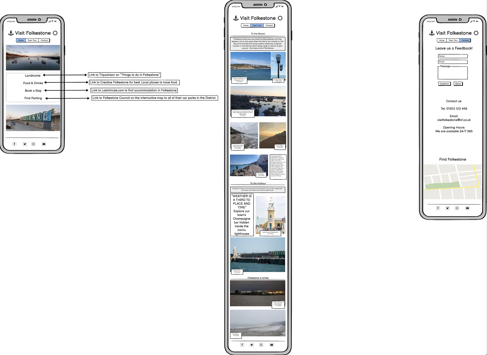

# Visit *Folkestone* Website

## Introduction

Welcome to [Visit *Folkestone*](https://mrbertieg.github.io/Visit-Folkestone/index.html) website.

This website is designed to help users visiting the town of Folkestone to find popular landmarks, find a place to eat, explore and book a stay. Folkestone is located in the South East of Kent, UK. It is home to the famous Eurotunel connecting the UK and France via an undergreound tunnel under the English Channel.

  

# Features

## Navigation 

- The Navigation bar features a Lighthouse as the Logo of the Page, the main title "Visit Folkestone" and the 3 navigation tabs. 
- The navigation tabs are: HOME | TOWN TOUR | CONTACT and each tab will take you to different pages on the website.
- The Navigation bar has an .active and .hover feature. 
- The background colour sample of the navigation tabs was sampled using a Chrome web browser extension called Eye Dropper. The colour was picked from the sky in the main banner picture in the landing page to establish a colour scheme. 
- The picture logo was custom made by using an online tool called [Brand Crowd](https://www.brandcrowd.com/).

  

## Header 

- The header contains the main banner of the page. The imaged in the banner zooms out as the user first loads up the page. 
- The header contains a section where it explains to the user what is the main purpose of the website.
- The colour scheme is continued in the headers description. 

  

## External Links Section 
- The External Links section is made of four links which redirect the user to different websites depending on their interest. Clicking on any of the links will open a new tab to an external website. The background colour for each title tag was set in a way that it contrast with the white writing for the best user experience.
These four links are:
    - Landmarks: This will take the user to an external webpage on [Tripadvisor](https://www.tripadvisor.co.uk/Attractions-g190749-Activities-c47-Folkestone_Kent_England.html)
    - Eat Local: This will take the user to an external webpage on [Folkelife.](https://folke.life/folkestone/food-and-drink/)
    - Books a Stay: This will take the user to an external webpage on [Trivago](https://www.trivago.co.uk/folkestone-39398/hotel)
    - Find Parking: This will take the user to an external webpage [Folkestone & Hythe District Council/Parking](https://www.folkestone-hythe.gov.uk/parking/car-parks)

  

## Visit Folkestone Video 
- The video is situated at the bottom of the page. It's a video of Folkestone and it has been taken from the [Folkestone & Hythe Distric Council Youtube channel](https://www.youtube.com/embed/6g7u5iQxjm8). The video will play within the page but it not play automatically or looped. The video has controls such as play and pause, mute and unmute. 

      

## Footer  

- The footer contains four logos, and each logo has it's own external clickable link.
- The colour of the icons is the same as the navigation tabs.
- The logos were imported from [Fontawesome](https://fontawesome.com/).

  

## Town Tour

- This page is split in to three sections.
- Each section contains photos of different parts of the town. All of the pictures have been taken by me. 
- The pictures are clickable with a new tab openining and directing the user to a google map location on where that set picture was take. This wat the user can find and experience each location.  
    - To the Beach!   
    - To the Harbour!   
    - To the High Street!     
    
  

  

## Contact

- This page contains a main picture banner, a feedback form where visitors can leave a commnet on their experience in visiting the town of Folkestone, contact details for the website's Admin Team and an interractive Google Maps for those who need to find out where Folkestone is located in the UK. 

  

## Website Wireframe

- The website's skeleton was designed using [Balsamiq]()
- Three versions were designed: Mobile, Tablet and Web Browser.
- Although the Website is not 100% identical to the wireframe, this has proven to be a useful tool in establishing how the website will be designed. 

Mobile 

Tablet

Web Browser

  

## Bugs

- There no bugs on this website.

  

## Manual Testing

- Chrome Developer Tools Lighthouse. Performance is in the amber zone due the the picture sizes. Visit Folkestone is a website designed to attract visitors so the aim is for the pictures to be as clear and high definition as possible to entice people to come over. The Website still performes well.

- W3C Validator.

- Jigsaw Validator.

